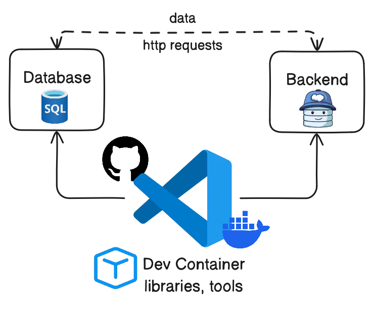

<!-- YAML front-matter schema: https://review.learn.microsoft.com/en-us/help/contribute/samples/process/onboarding?branch=main#supported-metadata-fields-for-readmemd -->

# Try Out Development Containers: Data API builder & Azure SQL Database

[](https://codespaces.new/microsoft/vscode-remote-try-dab/tree/main)
[](https://vscode.dev/redirect?url=vscode://ms-vscode-remote.remote-containers/cloneInVolume?url=https://github.com/microsoft/vscode-remote-try-dab/tree/main)

A **development container** is a running [Docker](https://www.docker.com) container with a well-defined tool/runtime stack and its prerequisites. You can try out development containers with **[GitHub Codespaces](https://github.com/features/codespaces)** or **[Visual Studio Code Remote - Containers](https://aka.ms/vscode-remote/containers)**.

This is a sample project that lets you try out either option in a few easy steps. We have a variety of other [vscode-remote-try-*](https://github.com/search?q=org%3Amicrosoft+vscode-remote-try-&type=Repositories) sample projects, too.

> **Note:** If you already have a Codespace or dev container, you can jump to the [About this](#about-this-template) section.

## Setting up the development container

### GitHub Codespaces

Follow these steps to open this sample in a Codespaces:

1. Click the Code drop-down menu and select the **Codespaces** tab.
1. Click on **Create codespaces on main** at the bottom of the pane.

For more info, check out the [GitHub documentation](https://docs.github.com/en/free-pro-team@latest/github/developing-online-with-codespaces/creating-a-codespace#creating-a-codespace).

### VS Code Dev Containers

If you already have VS Code and Docker installed, you can click the badge above or [here](https://vscode.dev/redirect?url=vscode://ms-vscode-remote.remote-containers/cloneInVolume?url=https://github.com/microsoft/vscode-remote-try-sqlserver) to get started. Clicking these links will cause VS Code to automatically install the Dev Containers extension if needed, clone the source code into a container volume, and spin up a dev container for use.

Follow these steps to open this sample in a container using the VS Code Dev Containers extension:

1. If this is your first time using a development container, please ensure your system meets the pre-reqs (i.e. have Docker installed) in the [getting started steps](https://aka.ms/vscode-remote/containers/getting-started).

2. To use this repository, you can either open the repository in an isolated Docker volume:

    - Press <kbd>F1</kbd> and select the **Dev Containers: Try a Sample...** command.
    - Choose the ".NET Core" sample, wait for the container to start, and try things out!
        > **Note:** Under the hood, this will use the **Dev Containers: Clone Repository in Container Volume...** command to clone the source code in a Docker volume instead of the local filesystem. [Volumes](https://docs.docker.com/storage/volumes/) are the preferred mechanism for persisting container data.

   Or open a locally cloned copy of the code:

   - Clone this repository to your local filesystem.
   - Press <kbd>F1</kbd> and select the **Dev Containers: Open Folder in Container...** command.
   - Select the cloned copy of this folder, wait for the container to start, and try things out!

## About this template

This template creates two containers, one for the Dev Container that includes .NET and Data API builder and one for Microsoft SQL Server. You will be connected to the Ubuntu, and from within that container the MS SQL container will be available on **`localhost`** port 1433. The Data API builder container also includes supporting scripts in the `.devcontainer/sql` folder used to configure the `Library` sample database.  



The SQL container is deployed from the latest developer edition of Microsoft SQL 2022. The database(s) are made available directly in the Codespace/VS Code through the MSSQL extension with a connection labeled "LocalDev". The default `sa` user password is set using the .devcontainer/.env file. The default SQL port is mapped to port `1433` in `.devcontainer/docker-compose.yml`.

Data API builder is a .NET Core application that provides a RESTful API for interacting with the database. This sample repository includes a preconfigured database, that is used by DAB to create the REST and GraphQL endpoints. Swagger UI offers a web-based UI that provides information about the REST endpoint, using the generated OpenAPI specification available at the default path: `http://localhost:5000/swagger/index.html`. Entities configured to be available via GraphQL are available at the default path: `http://localhost:5000/graphql`.

If you wan to run some manual tests, you can use the  `dab_http_request.sh` file included in the `scripts`folder. This `sh` file includes multiple http request calls you can to understand how the Data API builder to interact with the database.

> **Note:**
While the SQL Server container employs a standard version of SQL Server, all database development within this Dev Container can be validated for Azure SQL Database using the SQL Database Project. The SQL Database project is preconfigured with the target platform set as Azure SQL Database.

### Visual Code Tasks

We have added several tasks to this repository to help with common actions. You can access these tasks by opening the Command Palette in VS Code. Here's how:

1. Press <kbd>F1</kbd> or <kbd>Ctrl</kbd>+<kbd>Shift</kbd>+<kbd>P</kbd> to open the Command Palette.
2. Type "Run Task" and select "Tasks: Run Task".
3. Choose the task you want to run from the list.

#### Execute SQL Query (Verify database)

This task opens the `verifyDatabase.sql` file in your workspace and executes the SQL query in it. It uses the `ms-mssql.mssql` extension to execute the query. This task is part of the build group and is the default task that runs when you run the build task group.

#### Build SQL Database project (Optional)

This task builds the SQL Database project. It runs the command `dotnet build` in the `database/Library` directory of your workspace.

This task is optional, but it is useful to verify the database schema. You can use this SQL Database project to make changes to the database schema and deploy it to the SQL Server container.

#### Deploy SQL Database Project (Optional)

This task involves deploying the SQL Database project to your SQL Server container. It executes the `postCreateCommand.sh` script found in the `.devcontainer/sql` directory of your workspace.

The `postCreateCommand.sh` script requires one argument: the path to the directory containing the .dacpac file for the SQL Database project. In this scenario, that directory is `database/Library/bin/Debug`.

It utilizes the sqlpackage command-line utility to update the database schema using the .dacpac file, employing authentication credentials from the `.env` file situated in the `.devcontainer` directory.

#### Trust HTTPS certificate for Data API builder (DAB)

As this Dev Container users .NET 8, you need to trust the .NET HTTPS certificate before starting the Data API builder engine. This task runs the command dotnet dev-certs https --trust.

#### Start Data API builder (DAB) engine

This task starts the DAB engine using the configuration file located at `dab/dab.config.json`. It executes the command `dab start --config=dab.config.json --no-https-redirect` within the dab directory of your workspace.

> **Note:** Remember to check the Swagger and GraphQL endpoints after starting the DAB engine.

### Changing the SA password

To adjust the sa password, you need to modify the `.env` file located within the `.devcontainer` directory. This password is crucial for the creation of the SQL Server container and the deployment of the Library database using the `database/Library/bin/Debug/Library.dacpac` file.

The password must comply with the following rules:

- It should have a minimum length of 8 characters.
- It should include characters from at least three of the following categories: uppercase letters, lowercase letters, numbers, and non-alphanumeric symbols.

### Database deployment

By default, a demo database titled `Library` is created using a DAC package. The deployment process is automated through the `postCreateCommand.sh` script, which is specified in the devcontainer.json configuration:

```json
"postCreateCommand": "bash .devcontainer/sql/postCreateCommand.sh 'database/Library/bin/Debug'"
```

#### Automated Database Deployment

The `postCreateCommand.sh` script handles the database deployment by performing the following steps:

1. Loads the `SA_PASSWORD` from the `.env` file.
1. Waits for the SQL Server to be ready by attempting to connect multiple times.
1. Checks for .dacpac files in the specified directory (`database/Library/bin/Debug`).
1. Deploys each .dacpac file found to the SQL Server.

#### Using the SQL Database Projects Extension

You can use the SQL Database Projects extension to deploy the database schema. The Library.sqlproj project is located in the database/Library folder and can be built using the Build SQL Database project task. The output .dacpac files should be placed in the ./bin/Debug folder for deployment. 

#### Verifying the Database Schema

The `verifyDatabase.sql` file in the `database/Library` folder can be used to verify the database schema after deployment. You can run this script using the `Execute SQL Query` VS Code task.

This setup ensures that your databases are properly deployed and ready to use after the container is created.

### Adding another service

You can add other services to your `.devcontainer/docker-compose.yml` file [as described in Docker's documentation](https://docs.docker.com/compose/compose-file/#service-configuration-reference). However, if you want anything running in this service to be available in the container on localhost, or want to forward the service locally, be sure to add this line to the service config:

```yaml
# Runs the service on the same network as the database container, allows "forwardPorts" in devcontainer.json function.
network_mode: service:db
```

### Using the forwardPorts property

By default, web frameworks and tools often only listen to localhost inside the container. As a result, we recommend using the `forwardPorts` property to make these ports available locally.

```json
"forwardPorts": [9000]
```

The `ports` property in `docker-compose.yml` [publishes](https://docs.docker.com/config/containers/container-networking/#published-ports) rather than forwards the port. This will not work in a cloud environment like Codespaces and applications need to listen to `*` or `0.0.0.0` for the application to be accessible externally. Fortunately the `forwardPorts` property does not have this limitation.

## Contributing

This project welcomes contributions and suggestions.  Most contributions require you to agree to a
Contributor License Agreement (CLA) declaring that you have the right to, and actually do, grant us
the rights to use your contribution. For details, visit https://cla.opensource.microsoft.com.

When you submit a pull request, a CLA bot will automatically determine whether you need to provide
a CLA and decorate the PR appropriately (e.g., status check, comment). Simply follow the instructions
provided by the bot. You will only need to do this once across all repos using our CLA.

This project has adopted the [Microsoft Open Source Code of Conduct](https://opensource.microsoft.com/codeofconduct/).
For more information see the [Code of Conduct FAQ](https://opensource.microsoft.com/codeofconduct/faq/) or
contact [opencode@microsoft.com](mailto:opencode@microsoft.com) with any additional questions or comments.

## Trademarks

This project may contain trademarks or logos for projects, products, or services. Authorized use of Microsoft 
trademarks or logos is subject to and must follow 
[Microsoft's Trademark & Brand Guidelines](https://www.microsoft.com/en-us/legal/intellectualproperty/trademarks/usage/general).
Use of Microsoft trademarks or logos in modified versions of this project must not cause confusion or imply Microsoft sponsorship.
Any use of third-party trademarks or logos are subject to those third-party's policies.